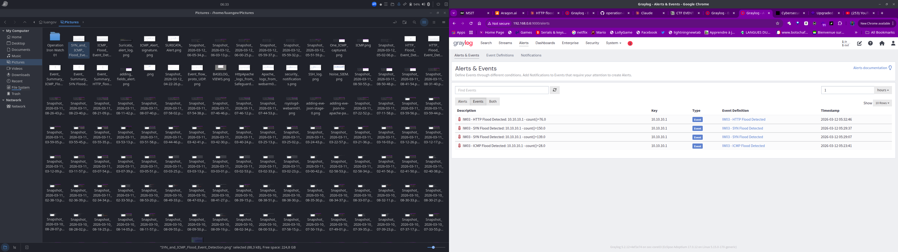

# Detection Rules — DDoS Detection Suite

This directory documents the detection rules built and validated during Operation Iron Watch 03. All rules were developed live against real log data flowing through the IW03 pipeline.

---

## Detection Philosophy

Rules in IW03 follow this cycle:

1. **Understand the log source** — know exactly what fields Graylog produces for each input
2. **Write a candidate rule** — based on real observed traffic patterns
3. **Test against live data** — confirm the rule fires correctly
4. **Document the rule** — logic, threshold rationale, severity, evidence
5. **Refine if needed** — adjust based on real environment behavior

> A rule that is not tested is not a detection. It is a guess.

---

## Key Architectural Finding — Flow vs Packet Detection

During implementation, a critical design lesson emerged that reshaped the detection approach for ICMP and SYN flood rules.

**Suricata tracks flows (sessions), not individual packets.** A continuous ICMP flood of 1,000 packets generates **one flow record** — making Graylog flow-count thresholds useless for volumetric ICMP detection. Detection logic for packet-rate attacks must live in the **IDS layer (Suricata rules)**, not the SIEM layer.

| Attack Type | Flow Records Generated | Flow Counting Valid? |
|-------------|----------------------|---------------------|
| HTTP Flood (1,000 requests) | ~1,000 — each request = separate connection | ✅ Yes |
| SYN Flood (closed port) | ~1 per packet — RST closes each flow immediately | ✅ Yes |
| SYN Flood (open port) | Few — half-open flows time out slowly | ⚠️ Unreliable |
| ICMP Flood (1,000 packets) | 1 — continuous session = one flow | ❌ No |

**Conclusion:** HTTP and SYN (closed port) work with Graylog flow counting. ICMP requires a Suricata threshold rule. SYN gets both — flow counting as primary, Suricata rule as reliable fallback.

---

## Detection Suite — Three Layers

| Rule | Layer | Detection Model | Threshold | Status |
|------|-------|----------------|-----------|--------|
| [HTTP Flood](http-flood.md) | L7 Application | Graylog event definition — `event_type:http` count per src_ip | > 50 req / 1 min | ✅ Validated |
| [SYN Flood](syn-flood.md) | L4 Transport | Graylog flow counting + Suricata rule (sid:9000002) | > 100 flows / 1 min | ✅ Validated |
| [ICMP Flood](icmp-flood.md) | L3 Network | Suricata threshold rule (sid:9000001) → Graylog alert event | > 50 packets / 60s | ✅ Validated |

---

## Suricata Custom Rules

File location: `/var/lib/suricata/rules/suricata.rules`
```suricata
# IW03 DDoS Detection Suite
alert icmp any any -> $HOME_NET any (msg:"IW03 - ICMP Flood Detected"; itype:8; threshold:type threshold, track by_src, count 50, seconds 60; sid:9000001; rev:1;)
alert tcp any any -> $HOME_NET 80 (msg:"IW03 - SYN Flood Detected"; flags:S; threshold:type threshold, track by_src, count 100, seconds 60; sid:9000002; rev:1;)
```

**Rule keyword notes:**
- `itype:8` — ICMP echo request only (not replies or unreachable)
- `flags:S` — TCP SYN flag set, the flood signature
- `threshold:type threshold` — fires once per N packets per time window per source
- `track by_src` — each source IP evaluated independently
- `sid:9000001/9000002` — custom/local rule ID range

---

## Graylog Event Definitions

| Event Definition | Filter | Threshold | Group-by |
|-----------------|--------|-----------|---------|
| IW03 - HTTP Flood Detected | `event_type:http` | count > 50 / 1 min | src_ip |
| IW03 - SYN Flood Detected | `event_type:flow AND proto:TCP` | count > 100 / 1 min | src_ip |
| IW03 - ICMP Flood Detected | `event_type:alert AND alert_signature:"IW03 - ICMP Flood Detected"` | count ≥ 1 / 1 min | src_ip |

---

## Validation Results

All three rules confirmed against live traffic from Safeguard Host (10.10.10.1) → web-arm01 (10.10.10.10):

| Rule | src_ip | count() | Timestamp |
|------|--------|---------|-----------|
| HTTP Flood Detected | 10.10.10.1 | 60 | 2026-03-12 03:52:46 |
| ICMP Flood Detected | 10.10.10.1 | 28 | 2026-03-12 05:23:41 |
| SYN Flood Detected | 10.10.10.1 | 139 | 2026-03-12 05:29:07 |



---

## Severity Enrichment

All alerts enriched with severity via Graylog pipeline rules:

| Severity | Meaning |
|----------|---------|
| `LOW` | Anomaly detected — informational |
| `MEDIUM` | Threshold crossed — warrants attention |
| `HIGH` | Sustained or escalating pattern — likely attack |
| `CRITICAL` | Confirmed attack pattern — immediate action required |

---

## Rule Files
```
05-detection-rules/
├── README.md       ← this file
├── http-flood.md   ← L7 rule
├── syn-flood.md    ← L4 rule
└── icmp-flood.md   ← L3 rule
```

---

## Implementation Status

| Item | Status |
|------|--------|
| Log pipeline delivering data to Graylog | ✅ Done |
| Graylog field mapping verified per log source | ✅ Done |
| HTTP Flood rule written and validated | ✅ Done |
| SYN Flood rule written and validated | ✅ Done |
| ICMP Flood rule written and validated | ✅ Done |
| Suricata custom rules deployed (sid:9000001, 9000002) | ✅ Done |
| Severity enrichment pipeline configured | ✅ Done |
| All rules validated with evidence screenshots | ✅ Done |
