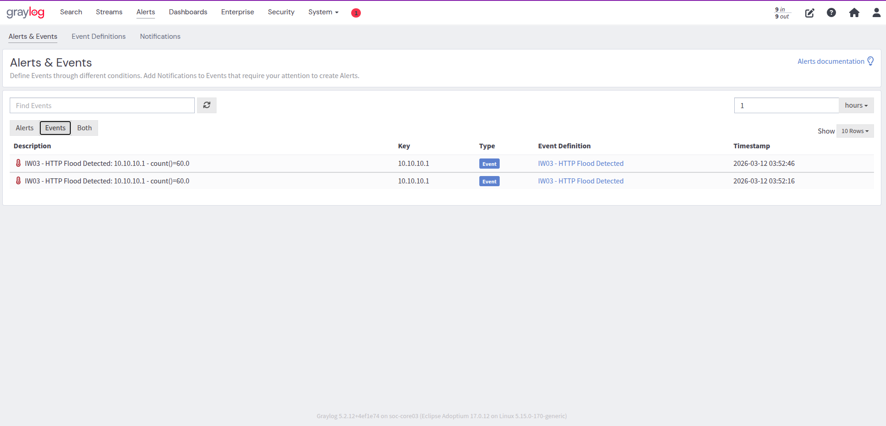
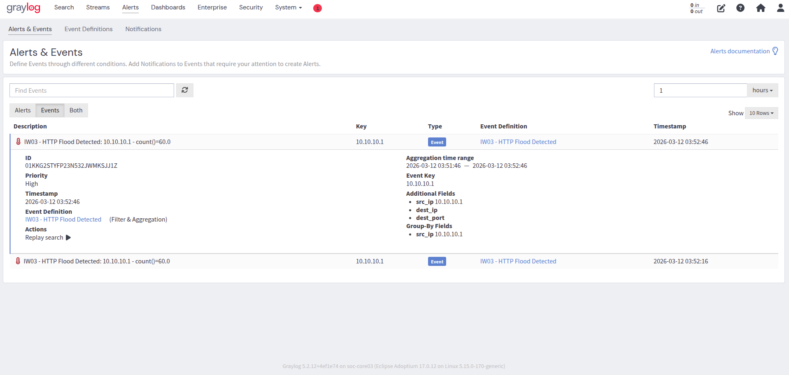

# HTTP Flood Detection — L7 Application Layer

**Rule ID:** IW03-DETECT-001  
**Layer:** L7 — Application  
**Log Source:** Apache `access.log` → rsyslog → sentry-gate01 → Graylog  
**Status:** ✅ Validated — 2026-03-12

---

## What It Detects

A volumetric HTTP flood — an abnormal spike in HTTP requests from a single source IP within a short time window. The attacker completes the full TCP handshake and sends legitimate-looking HTTP requests at machine-gun rate, exhausting web server resources.

**Why it is detectable at L7:**  
Each HTTP request generates a separate Apache access.log entry. A flood of 1,000 requests produces 1,000 log entries — making count-based thresholds in Graylog effective.

---

## Detection Model

**Type:** Graylog Event Definition (Filter & Aggregation)  
**No Suricata rule required** — HTTP requests are fully visible in access.log.

### Graylog Query
```
event_type:http
```

### Aggregation
- **Function:** count()
- **Threshold:** > 50
- **Time window:** 1 minute
- **Group-by:** src_ip

### Event Definition Settings
| Field | Value |
|-------|-------|
| Name | IW03 - HTTP Flood Detected |
| Priority | High |
| Type | Filter & Aggregation |
| Filter | `event_type:http` |
| Grouping | src_ip |
| Threshold | count() > 50 / 1 min |

---

## Log Source — Fields Used

Graylog extracts the following fields from Apache access.log via Grok extractor:

| Field | Example | Description |
|-------|---------|-------------|
| `event_type` | `http` | Set by Graylog pipeline rule |
| `src_ip` | `10.10.10.1` | Client IP from access.log |
| `http_status` | `200` | HTTP response code |
| `request` | `GET / HTTP/1.1` | Request line |
| `dest_ip` | `10.10.10.10` | Web server IP |

---

## Threshold Rationale

50 requests per minute was chosen for the home lab environment. In production this would be calibrated against a baseline of normal traffic. At 50 req/min, legitimate human browsing does not trigger the rule — only scripted or automated request patterns do.

**Known gap:** Slow-and-low HTTP attacks (e.g. Slowloris) operate below volume thresholds and will not be detected by this rule. Slowloris detection requires connection timeout monitoring, not request counting.

---

## Test Method

```bash
# Apache Bench from Safeguard Host
ab -n 200 -c 10 http://10.10.10.10/

# Or curl loop
for i in $(seq 1 200); do curl -s http://10.10.10.10/ > /dev/null & done
```

---

## Validation Evidence

| Item | Value |
|------|-------|
| src_ip | 10.10.10.1 |
| dest_ip | 10.10.10.10 |
| count() | 60 |
| Timestamp | 2026-03-12 03:52:46 |
| Graylog Event | IW03 - HTTP Flood Detected |
| Priority | High |


*Graylog Events tab — two HTTP Flood events fired*


*Event detail — src_ip 10.10.10.1, count()=60, priority High*

Two events fired in the same 1-hour window confirming consistent detection across multiple test runs.

---

## MITRE ATT&CK

| Technique | Name | Tactic |
|-----------|------|--------|
| T1499.002 | Endpoint DoS: Service Exhaustion Flood | Impact |
