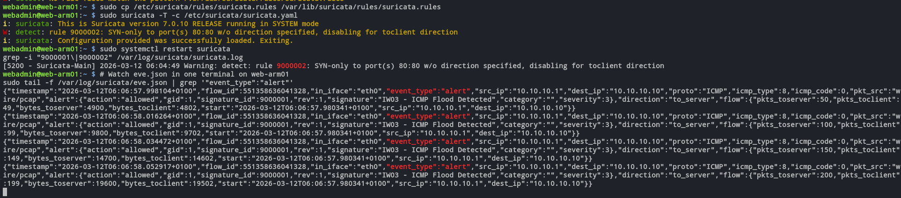
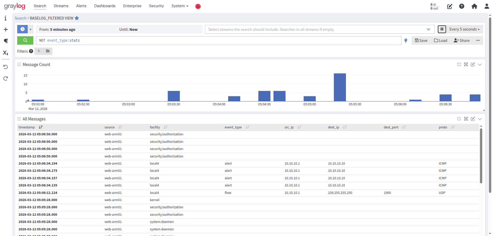
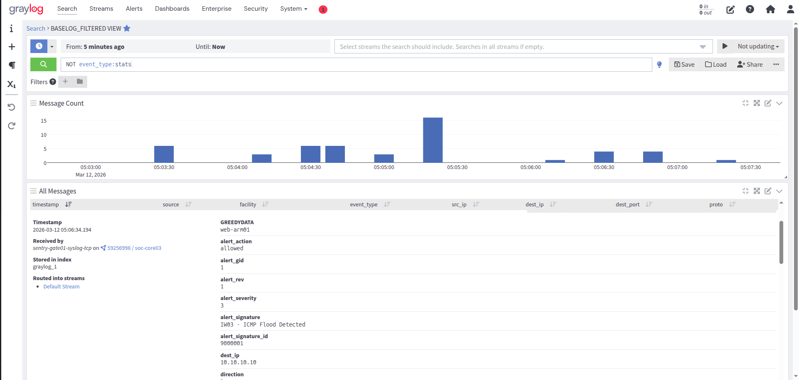
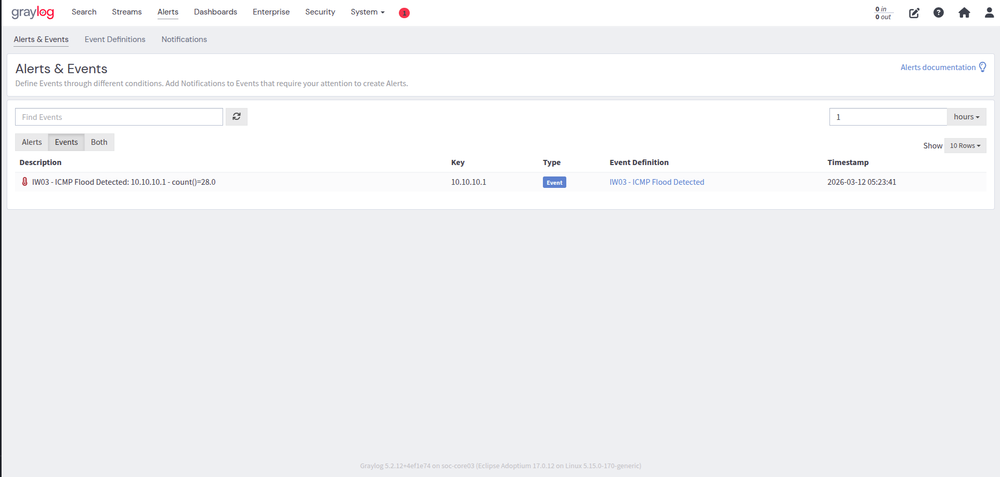
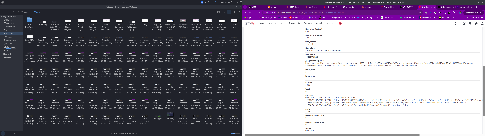

# ICMP Flood Detection — L3 Network Layer

**Rule ID:** IW03-DETECT-003  
**Layer:** L3 — Network  
**Log Source:** Suricata threshold rule → EVE JSON alert → rsyslog → sentry-gate01 → Graylog  
**Status:** ✅ Validated — 2026-03-12

---

## What It Detects

A volumetric ICMP flood — the attacker sends a high volume of ICMP echo requests (ping) to saturate the target's bandwidth or CPU, denying service to legitimate traffic.

---

## Detection Model

**Type:** Suricata threshold rule → Graylog Event Definition (alert-based)

### Why Graylog Flow Counting Fails for ICMP

This is the most important architectural lesson from IW03 detection engineering.

Suricata tracks **flows** (sessions), not individual packets. A continuous ping flood of any size — 10 packets or 10,000 packets — generates **exactly one ICMP flow record**, written when the session closes or times out. No matter how high you set a Graylog count threshold on `event_type:flow AND proto:ICMP`, it can never be reached from a single flood session.

**The fix:** Move detection logic to the IDS layer. Suricata's `threshold` keyword evaluates at the **packet level** within a time window and fires an `event_type:alert` record when the condition is met. Graylog then simply counts alert events — one alert = flood confirmed.

```
❌ Wrong model:  Graylog counts ICMP flows    → always 1 per session → never fires
✅ Correct model: Suricata counts ICMP packets → fires alert → Graylog surfaces it
```

### Suricata Rule

```suricata
alert icmp any any -> $HOME_NET any (msg:"IW03 - ICMP Flood Detected"; itype:8; threshold:type threshold, track by_src, count 50, seconds 60; sid:9000001; rev:1;)
```

**Rule keyword notes:**
- `itype:8` — ICMP echo request only (type 8 = ping). Excludes replies, unreachable, redirect
- `threshold:type threshold` — fires once per 50 matching packets per 60s window per source
- `track by_src` — each source IP evaluated independently
- `sid:9000001` — custom/local rule ID range

### Graylog Event Definition

```
event_type:alert AND alert_signature:"IW03 - ICMP Flood Detected"
```

- **Threshold:** count() ≥ 1 / 1 minute
- **Group-by:** src_ip
- **Rationale:** The threshold logic already lives in the Suricata rule. One alert event reaching Graylog means the flood condition was already confirmed at the IDS layer. No additional counting needed in the SIEM.

---

## Log Source — Fields Used

| Field | Example | Description |
|-------|---------|-------------|
| `event_type` | `alert` | Suricata alert event |
| `alert_signature` | `IW03 - ICMP Flood Detected` | Rule message |
| `alert_signature_id` | `9000001` | Suricata SID |
| `alert_severity` | `3` | Suricata severity level |
| `src_ip` | `10.10.10.1` | Attacker source IP |
| `dest_ip` | `10.10.10.10` | Target host |
| `proto` | `ICMP` | Protocol |

---

## Threshold Rationale

50 ICMP echo requests per 60 seconds cleanly separates diagnostic ping traffic (`ping -c 4` = 4 packets) from flood behavior (`ping -f` = hundreds per second). Calibrated for home lab environment.

**Known gap:** ICMP floods from multiple distributed sources (each below 50 packets/60s) will evade per-source tracking. Also, if ICMP is blocked at the network layer entirely, there is no traffic for Suricata to see — no traffic means no alert, but also no flood reaching the target.

---

## Test Method

```bash
# Flood ping from Safeguard Host
sudo ping -f -c 200 10.10.10.10

# Or with hping3
sudo hping3 --icmp -c 200 --fast 10.10.10.10
```

Watch eve.json on web-arm01 during the test:

```bash
sudo tail -f /var/log/suricata/eve.json | grep '"event_type":"alert"'
```

---

## Troubleshooting History

**Initial attempt — flow counting failed:**  
The first implementation used `event_type:flow AND proto:ICMP` in the Graylog event definition. Running a flood ping produced exactly one flow record — the event definition never fired regardless of packet count. This led to the architectural redesign documented above.

**Rule not loading:**  
Rules placed in `/etc/suricata/rules/suricata.rules` were not loading because Suricata's `default-rule-path` in `suricata.yaml` points to `/var/lib/suricata/rules/`. Fix: copy rules to the correct path and validate with `sudo suricata -T -c /etc/suricata/suricata.yaml`.

---

## Validation Evidence

| Item | Value |
|------|-------|
| src_ip | 10.10.10.1 |
| dest_ip | 10.10.10.10 |
| count() | 28 |
| Timestamp | 2026-03-12 05:23:41 |
| Graylog Event | IW03 - ICMP Flood Detected |
| Priority | High |


*eve.json tail — alert records firing during ICMP flood test*


*Graylog stream — event_type:alert ICMP events from 10.10.10.1*


*Graylog message detail — alert_signature, sid 9000001, structured fields*


*Graylog Events — IW03 - ICMP Flood Detected, count()=28, 2026-03-12 05:23*


*Single ICMP flow record — demonstrates why flow counting fails for ICMP flood detection*

---

## MITRE ATT&CK

| Technique | Name | Tactic |
|-----------|------|--------|
| T1498.001 | Network DoS: Direct Network Flood | Impact |
