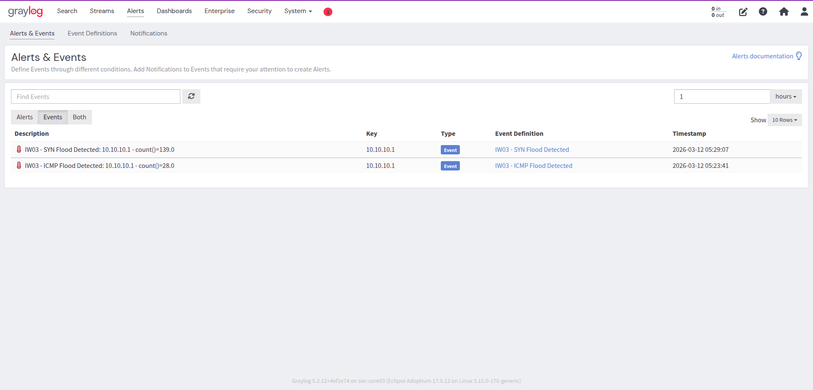

# SYN Flood Detection — L4 Transport Layer

**Rule ID:** IW03-DETECT-002  
**Layer:** L4 — Transport  
**Log Source:** Suricata EVE JSON + Graylog flow counting → rsyslog → sentry-gate01 → Graylog  
**Status:** ✅ Validated — 2026-03-12

---

## What It Detects

A TCP SYN flood — the attacker sends a high volume of SYN packets without completing the three-way handshake. The goal is to exhaust the server's connection table with half-open connections, denying service to legitimate clients.

---

## Detection Model

**Type:** Dual-layer — Graylog flow counting (primary) + Suricata threshold rule (reliable fallback)

### Why Two Layers

Graylog flow counting works for SYN flood **only when targeting closed ports** — each SYN receives an immediate RST response, closing the flow instantly and generating a separate flow record per packet. Against open ports, half-open connections linger until timeout, producing far fewer flow records and making threshold detection unreliable.

The Suricata rule operates at the packet level and is port/state agnostic — it fires regardless of whether the target port is open or closed.

| Scenario | Flow Records | Flow Counting Valid? |
|----------|-------------|---------------------|
| SYN → closed port (RST immediate) | ~1 per packet | ✅ Yes |
| SYN → open port (half-open, slow timeout) | Few | ⚠️ Unreliable |
| Suricata rule (packet-level) | N/A — alert per threshold | ✅ Always |

### Layer 1 — Graylog Event Definition

```
event_type:flow AND proto:TCP
```

- **Threshold:** count() > 100 / 1 minute
- **Group-by:** src_ip

### Layer 2 — Suricata Rule

```suricata
alert tcp any any -> $HOME_NET 80 (msg:"IW03 - SYN Flood Detected"; flags:S; threshold:type threshold, track by_src, count 100, seconds 60; sid:9000002; rev:1;)
```

**Rule keyword notes:**
- `flags:S` — matches TCP SYN flag only (the flood signature)
- `threshold:type threshold` — fires once per 100 SYN packets per 60s window per source
- `track by_src` — each source IP evaluated independently
- `sid:9000002` — custom/local rule ID range

> Note: Suricata emits a warning that the rule is disabled for `toclient` direction. This is expected and harmless — SYN flood packets travel client → server only.

---

## Log Source — Fields Used

| Field | Example | Description |
|-------|---------|-------------|
| `event_type` | `flow` / `alert` | Flow record or Suricata alert |
| `proto` | `TCP` | Protocol |
| `src_ip` | `10.10.10.1` | Attacker source IP |
| `dest_ip` | `10.10.10.10` | Target web server |
| `alert_signature` | `IW03 - SYN Flood Detected` | Suricata rule message |
| `alert_signature_id` | `9000002` | Suricata SID |

---

## Threshold Rationale

100 SYN packets per minute is a conservative threshold for the home lab. In real environments, SYN floods typically operate at thousands of packets per second. The lower threshold ensures detection is visible in a controlled test while not being so sensitive it triggers on normal TCP connection establishment.

**Known gap:** Distributed SYN floods (multiple source IPs below individual thresholds) will evade per-source tracking. Detection of distributed floods requires aggregate counting, not per-src grouping.

---

## Test Method

```bash
# From Safeguard Host — target closed port for immediate RST
sudo hping3 -S -p 9999 -c 150 --fast 10.10.10.10

# Against port 80 (open) — tests Suricata rule specifically
sudo hping3 -S -p 80 -c 150 --fast 10.10.10.10
```

**Why port 9999:** Targeting a closed port forces immediate RST responses — each flow closes instantly, generating ~150 separate flow records in quick succession. This makes Graylog flow counting reliable for test validation.

---

## Validation Evidence

| Item | Value |
|------|-------|
| src_ip | 10.10.10.1 |
| dest_ip | 10.10.10.10 |
| count() | 139 |
| Timestamp | 2026-03-12 05:29:07 |
| Graylog Event | IW03 - SYN Flood Detected |
| Priority | High |


*Graylog Events — all three detections confirmed in single view*

---

## MITRE ATT&CK

| Technique | Name | Tactic |
|-----------|------|--------|
| T1498.001 | Network DoS: Direct Network Flood | Impact |
| T1499.001 | Endpoint DoS: OS Exhaustion Flood | Impact |
