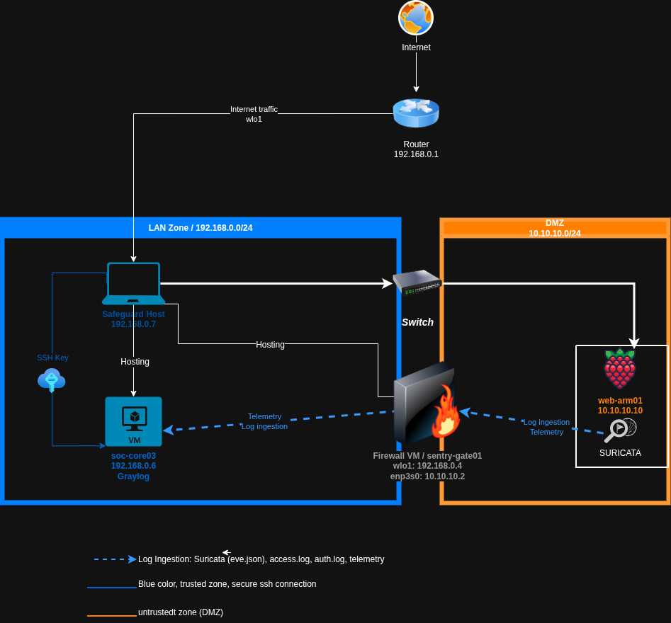

# 🔐 Operation Iron Watch 03
## DMZ Hardening, Log Pipeline & Detection Engineering

[](https://github.com/cyberlandji/operation-iron-watch-03)
[](https://github.com/cyberlandji)
[](https://github.com/cyberlandji/operation-iron-watch-03)
[](https://attack.mitre.org/)

---



---

## 📌 Overview

Operation Iron Watch 03 is the hardening and detection engineering phase of the Iron Watch series.

Iron Watch 02 exposed a critical gap: the SSH compromise of `web-arm01` was **completely invisible** on the SIEM because `auth.log` was never ingested. The attacker moved freely while Graylog only watched HTTP 404 spikes. IW03 is the direct response to that failure.

This operation introduces a proper **DMZ architecture** with physical network isolation, a **firewall/relay layer** (sentry-gate01), an **expanded multi-source log pipeline**, and a validated **three-layer DDoS Detection Suite**. No attacker is simulated — this is pure hardening and proactive detection engineering.

---

## 🎯 Objectives

- Isolate `web-arm01` in a dedicated DMZ subnet (10.10.10.0/24) via physical ethernet + switch
- Deploy `sentry-gate01` as a dual-NIC firewall and rsyslog relay between DMZ and LAN
- Expand Graylog log ingestion to `auth.log`, Suricata EVE JSON, and Apache `access.log`
- Implement SSH key-only authentication and harden the SSH daemon configuration
- Build and validate a three-layer DDoS Detection Suite (L3 / L4 / L7)

---

## 🏗️ Network Architecture

### Topology

```
[Internet / WAN]
       |
[Safeguard Host] wlo1 — LAN (192.168.0.x)
       |                        |
  enp3s0 (10.10.10.1)    [soc-core03 VM]
       |                  Graylog 5.2
[TP-Link TL-SF1005D]      192.168.0.6
       |
[web-arm01 Pi 3B+]              ↑
  10.10.10.10              [sentry-gate01 VM]
  Apache2 + Suricata       10.10.10.2 (DMZ)
                           192.168.0.4 (LAN)
                           rsyslog relay
```

### Host Table

| Host | Role | IP Address(es) | Platform |
|------|------|---------------|----------|
| Safeguard Host | Hypervisor / DMZ gateway | 10.10.10.1 (enp3s0), LAN (wlo1) | Physical Linux |
| web-arm01 | DMZ web server + IDS | 10.10.10.10/24 | Raspberry Pi 3B+ |
| sentry-gate01 | Firewall / rsyslog relay | 10.10.10.2 (DMZ), 192.168.0.4 (LAN) | VirtualBox VM |
| soc-core03 | SIEM | 192.168.0.6 | VirtualBox VM |
| TP-Link TL-SF1005D | DMZ switch | — | Unmanaged switch |

### Log Pipeline

```
web-arm01 (10.10.10.10)
   ├── auth.log       ─┐
   ├── access.log     ─┼─► rsyslog imfile ──► sentry-gate01 (10.10.10.2:514)
   └── eve.json       ─┘                              │
                                                       ▼
                                          soc-core03 Graylog (192.168.0.6:514)
```

---

## 🛡️ Hardening

### SSH — web-arm01
- Ed25519 key pair — password authentication disabled
- `sshd_config` hardened: `PermitRootLogin no`, `MaxAuthTries 3`, `AllowAgentForwarding no`
- **Critical fix:** `/etc/ssh/sshd_config.d/50-cloud-init.conf` was silently overriding all hardening — file removed
- UFW enabled with minimal ruleset: SSH (22), HTTP (80), rsyslog (514)

### Network Segmentation
- `web-arm01` isolated in DMZ subnet 10.10.10.0/24
- Physical isolation via TP-Link TL-SF1005D unmanaged switch
- `sentry-gate01` configured as dual-NIC relay — DMZ has no direct path to SIEM
- Netplan configuration persistent across reboots on sentry-gate01

---

## 🔍 Detection Suite — DDoS Detection

IW03 implements a **three-layer DDoS Detection Suite** covering distinct attack vectors at different network layers.

### Architecture Decision — Why Rules Matter for ICMP

During implementation a key finding emerged: Suricata tracks *flows* (sessions), not individual packets. A continuous ICMP flood of 1,000 packets generates **one flow record** — making flow-count thresholds useless for volumetric ICMP detection. Detection logic for ICMP therefore belongs in the **IDS layer (Suricata rules)**, not the SIEM layer.

SYN Flood behaves differently: targeting a closed port forces immediate RST responses, closing each flow instantly and generating separate flow records — so Graylog flow counting also works for SYN in this scenario.

| Rule | Layer | Detection Model | Threshold |
|------|-------|----------------|-----------|
| HTTP Flood | L7 | Graylog event definition — `event_type:http` count per src_ip | > 50 req / 1 min |
| SYN Flood | L4 | Graylog flow counting (closed port) + Suricata rule (sid:9000002) | > 100 flows / 1 min |
| ICMP Flood | L3 | Suricata threshold rule (sid:9000001) → Graylog alert event | > 50 packets / 60s |

### Suricata Custom Rules

```suricata
# IW03 DDoS Detection Suite
alert icmp any any -> $HOME_NET any (msg:"IW03 - ICMP Flood Detected"; itype:8; threshold:type threshold, track by_src, count 50, seconds 60; sid:9000001; rev:1;)
alert tcp any any -> $HOME_NET 80 (msg:"IW03 - SYN Flood Detected"; flags:S; threshold:type threshold, track by_src, count 100, seconds 60; sid:9000002; rev:1;)
```

---

## ✅ Validation Results

All three detection rules confirmed against live traffic from Safeguard Host (10.10.10.1) → web-arm01 (10.10.10.10):

| Detection Rule | src_ip | count() | Timestamp | Status |
|---------------|--------|---------|-----------|--------|
| IW03 - HTTP Flood Detected | 10.10.10.1 | 60 | 2026-03-12 03:52:46 | ✅ Confirmed |
| IW03 - ICMP Flood Detected | 10.10.10.1 | 28 | 2026-03-12 05:23:41 | ✅ Confirmed |
| IW03 - SYN Flood Detected | 10.10.10.1 | 139 | 2026-03-12 05:29:07 | ✅ Confirmed |

---

## 🛠️ Tooling

| Tool | Host | Role |
|------|------|------|
| Graylog 5.2 | soc-core03 | SIEM — log ingestion, event definitions, pipeline enrichment |
| Suricata 7.0 | web-arm01 | Network IDS — EVE JSON output, custom detection rules |
| rsyslog | web-arm01 + sentry-gate01 | Log forwarding and DMZ relay chain |
| Apache2 | web-arm01 | Web server — access.log source |
| UFW | web-arm01 | Host firewall |
| TP-Link TL-SF1005D | DMZ | Physical switch for DMZ segment isolation |
| draw.io | — | Architecture diagrams |
| hping3 | Safeguard Host | SYN flood test traffic generation |

---

## ⚠️ Key Troubleshooting

| Issue | Root Cause | Resolution |
|-------|-----------|------------|
| DMZ connectivity blocked | Direct ethernet hairpin doesn't support VirtualBox bridged adapters | TP-Link TL-SF1005D switch installed |
| SSH hardening bypassed silently | `/etc/ssh/sshd_config.d/50-cloud-init.conf` overriding sshd_config | File removed, hardening confirmed |
| rsyslog imfile error | Legacy vs modern module syntax conflict | Corrected rsyslog.conf syntax |
| Graylog `http_publish_uri` mismatch | Old IW02 host-only IP still set after VM migration | Updated to 192.168.0.6 |
| Suricata rules not loading | Rules in `/etc/suricata/rules/` but default-rule-path is `/var/lib/suricata/rules/` | Copied to correct path, validated with `suricata -T` |
| ICMP flow-based detection fails | One flow per session regardless of packet count | Detection redesigned using Suricata threshold rules |
| Pi clock drift | No NTP access on isolated DMZ subnet | Manual `date` set — known limitation |

> Full troubleshooting documentation: `IW03_Troubleshooting_Log.docx`

---

## 🗂️ Repository Structure

```
operation-iron-watch-03/
│
├── 01-architecture/       # Network diagram, zone design, IP plan
├── 02-context/            # IW02 lessons learned, threat model, design decisions
├── 03-hardening/          # SSH hardening, DMZ setup, UFW rules
├── 04-log-pipeline/       # rsyslog configs, Graylog inputs, EVE JSON parsing
├── 05-detection-rules/    # DDoS Detection Suite — rules + Graylog event definitions
├── evidences/             # Screenshots, alert captures, log samples
└── README.md
```

---

## 🔗 MITRE ATT&CK Coverage

| Technique | Name | Tactic | Detection |
|-----------|------|--------|-----------|
| T1498.001 | Network DoS: Direct Network Flood | Impact | Suricata ICMP/SYN rules |
| T1499.001 | Endpoint DoS: OS Exhaustion Flood | Impact | Suricata SYN rule |
| T1499.002 | Endpoint DoS: Service Exhaustion Flood | Impact | HTTP Flood event definition |
| T1110 | Brute Force | Credential Access | auth.log → Graylog |
| T1021.004 | Remote Services: SSH | Lateral Movement | auth.log structured ingestion |

---

## 🔗 Iron Watch Series

| Episode | Focus | Status |
|---------|-------|--------|
| [Iron Watch 01](https://github.com/cyberlandji/operation-iron-watch-01) | Foundational SOC — Snort IDS, network visibility | ✅ Complete |
| [Iron Watch 02](https://github.com/cyberlandji/operation-iron-watch-02) | Graylog SIEM — web enumeration detection, auth.log gap discovered | ✅ Complete |
| **Iron Watch 03** | **DMZ hardening, log pipeline, DDoS Detection Suite** | ✅ Complete |

---

## 👤 Author

**cyberlandji** — Blue Team Practitioner | ISC2 CC | CompTIA Security+ (in progress)

Portfolio: [cyberlandji.com](https://cyberlandji.com) · GitHub: [github.com/cyberlandji](https://github.com/cyberlandji)

---

*Part of the Operation Iron Watch home lab series — building real SOC capability from scratch.*
